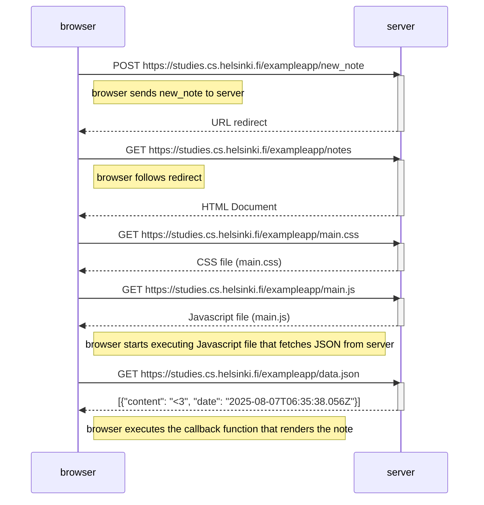

```mermaid
sequenceDiagram
   participant browser
   participant server

   browser->>server: POST https://studies.cs.helsinki.fi/exampleapp/new_note
   activate server
   Note right of browser: browser sends new_note to server
   server-->>browser: URL redirect
   deactivate server

   browser->>server: GET https://studies.cs.helsinki.fi/exampleapp/notes
   activate server
   Note right of browser: browser follows redirect
   server-->>browser: HTML Document
   deactivate server

   browser->>server: GET https://studies.cs.helsinki.fi/exampleapp/main.css
   activate server
   server-->>browser: CSS file (main.css)
   deactivate server

   browser->>server: GET https://studies.cs.helsinki.fi/exampleapp/main.js
   activate server
   server-->>browser: Javascript file (main.js)
   deactivate server

   Note right of browser: browser starts executing Javascript file that fetches JSON from server

   browser->>server: GET https://studies.cs.helsinki.fi/exampleapp/data.json
   activate server
   server-->>browser: [{"content": "<3", "date": "2025-08-07T06:35:38.056Z"}]
   deactivate server

   Note right of browser: browser executes the callback function that renders the note

```
