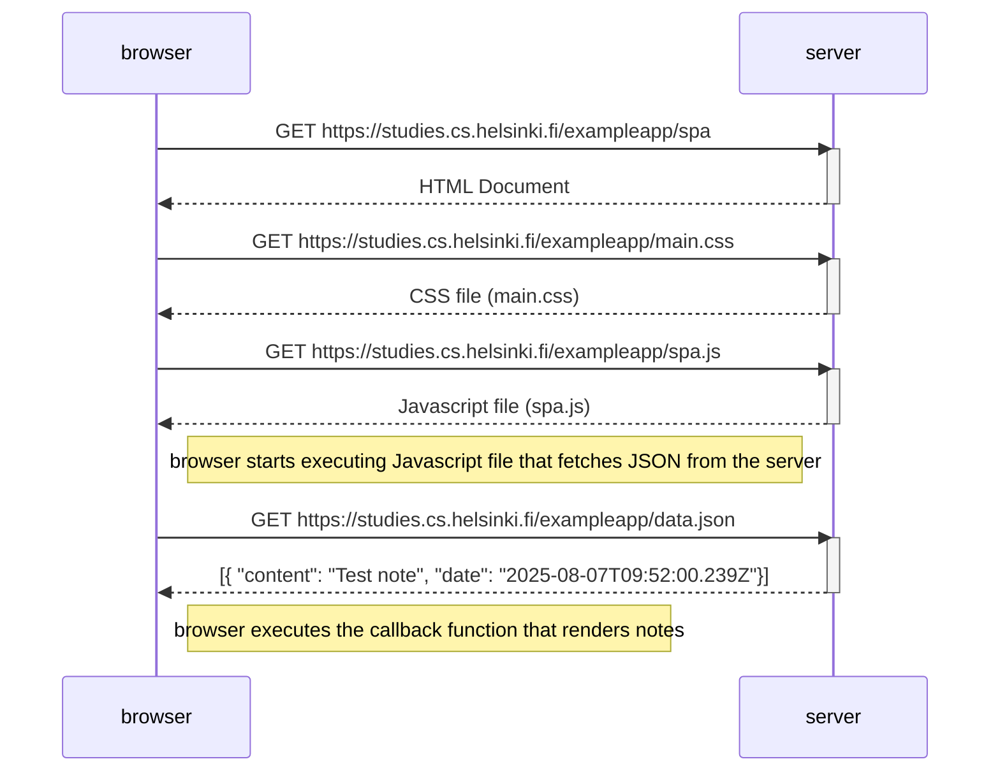

```mermaid
sequenceDiagram
   participant browser
   participant server

   browser->>server: GET https://studies.cs.helsinki.fi/exampleapp/spa
   activate server
   server-->>browser: HTML Document
   deactivate server

   browser->>server: GET https://studies.cs.helsinki.fi/exampleapp/main.css
   activate server
   server-->>browser: CSS file (main.css)
   deactivate server

   browser->>server: GET https://studies.cs.helsinki.fi/exampleapp/spa.js
   activate server
   server-->>browser: Javascript file (spa.js)
   deactivate server

   Note right of browser: browser starts executing Javascript file that fetches JSON from the server

   browser->>server: GET https://studies.cs.helsinki.fi/exampleapp/data.json
   activate server
   server-->>browser: [{ "content": "Test note", "date": "2025-08-07T09:52:00.239Z"}]
   deactivate server

   Note right of browser: browser executes the callback function that renders notes

```
