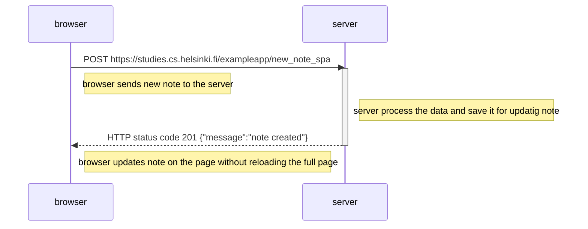

```mermaid
sequenceDiagram
   participant browser
   participant server

   browser->>server: POST https://studies.cs.helsinki.fi/exampleapp/new_note_spa
   activate server
   Note right of browser: browser sends new note to the server
   Note right of server: server process the data and save it for updatig note
   server-->>browser: HTTP status code 201 {"message":"note created"}
   deactivate server

   Note right of browser: browser updates note on the page without reloading the full page

```
